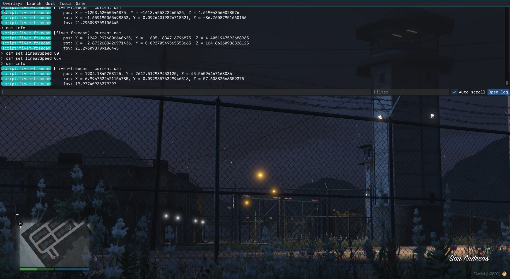

# fivem-freecam
## Basic free-camera client resource
This resource offers a player-controllable freecam that can be flown around the game world.



## Usage
### Setup
Drop this folder in your server's `server-data\resources\[local]`, then in your `server.cfg` add this line:

```
ensure fivem-freecam
```

or run this in the server commandline:

```
start fivem-freecam
```

### Getting started
Executing the `/cam` command (either in a text chat or by typing `cam` after pressing F8 to open the console) will toggle the camera on/off.

### Controls
|           Control           |          Use          |
|:---------------------------:|:---------------------:|
|      WASD / Left Stick      | Move Forward/Sideways |
|     Mouse / Right Stick     |      Look Around      |
|   Left-Right Arrows/D-pad   |         Roll          |
| X / C (Left/Right Triggers) |    FOV Wide/Narrow    |
| Q / E (Left/Right Bumpers)  |     Move Up/Down      |

### Commands
|          Command           | Description                                                        |
|:--------------------------:|--------------------------------------------------------------------|
|          /cam on           | Enables the camera.                                                |
|          /cam off          | Disables the camera.                                               |
|            /cam            | Toggles camera on/off                                              |
|         /cam info          | Displays the current camera position, rotation (order 2), and FOV. |
| /cam set `setting` `value` | Changes a setting. See [Settings](#settings).                      |
|          /cam tp           | Teleports the local player ped to the current camera position.     |

### Settings
|   Setting    |    Value type     | Description                                                                 |
|:------------:|:-----------------:|-----------------------------------------------------------------------------|
| linearSpeed  |      number       | The speed at which the camera moves.                                        |
| angularSpeed |      number       | The speed at which the camera rotates.                                      |
|   fovSpeed   |      number       | The speed at which the camera zooms.                                        |
|   streamOn   | `true` or `false` | If `true`, the game will set world detail streaming focus around the camera |